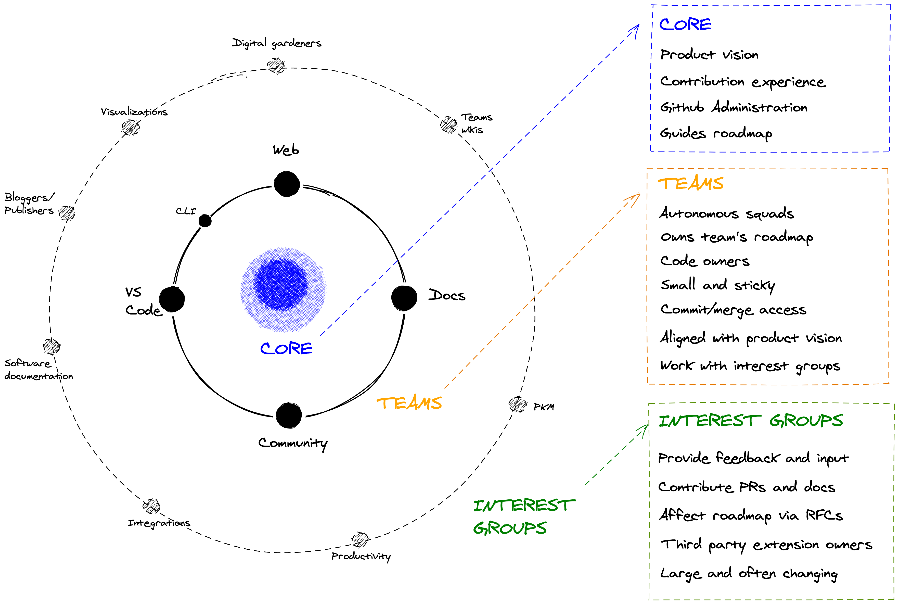

# Governance

[View on Excalidraw](https://excalidraw.com/#json=5928978384683008,X3ReJbFYLKeREUlE2lu8ww)

## Core

- Defines product vision
- Provides high-level roadmap direction
- Guards the governance model
- Provides support for teams and contributors
- Release management
- GitHub administration
- **Veto power** (for the time being)

## Teams

- Small teams of frequent/committed contributors
  - 1-7 people 
- Some continuous commitment to the project expected (inasmuch possible in an Open Source project)
- Autonomous squads with ability to
  - Prioritise their own roadmap
  - Introduce new roadmap items that align with overall product vision
  - Commit, review and merge code within their team's source code projects
- Work closely with other teams, and can work across team boundaries to implement features end to end
- Work closely with interest groups

#### Editor

- VS Code Extension
- "Everything that happens on your local machine"

#### Web

- Web publishing

#### Docs

- Foam documentation
- Future website

#### Community

- Community management
- Content 

## Interest groups 

- Collections like-minded folks who are interested in improving Foam.
- Represents a use case or a focus area of Foam:
  - Personal Knowledge Management
  - Team Documentation
  - Digital Gardeners
  - Spaced Repetition
  - Writers
- Has an "official" channel in Foam Discord
- May organise virtual meetings and choose how they work and interact
- Large and loosely connected, no firm commitments required.
- Non-decision-making bodies
- Must be open and inclusive to new members
- Contribute to roadmap via RFCs (request for comments) (See e.g. [React RFCs](https://github.com/reactjs/rfcs)) that are reviewed by Core and Teams.
- Contribute code via PRs
- May own and independently manage third party extensions

# Defining the User and Use Case

# RFC process

Similar to [React RFCs](https://github.com/reactjs/rfcs) and [Rust RFCs](https://github.com/rust-lang/rfcs), the Foam RFC process should be its own repository.

Many changes, including bug fixes and documentation improvements can be implemented and reviewed via the normal GitHub pull request workflow.

Some changes though are "substantial", and we ask that these be put through a bit of a design process and produce a consensus among the Foam community and the sub-teams.

The "RFC" (request for comments) process is intended to provide a consistent and controlled path for new features to enter the Foam ecosystem, so that all stakeholders can be confident about the direction the tool is evolving in.
  
## Roadmap

The Roadmap should be its own repository / GitHub project (**ideas welcome**).

See: [[roadmap-v2]]

[//begin]: # "Autogenerated link references for markdown compatibility"
[roadmap-v2]: roadmap-v2 "Roadmap v2"
[//end]: # "Autogenerated link references"